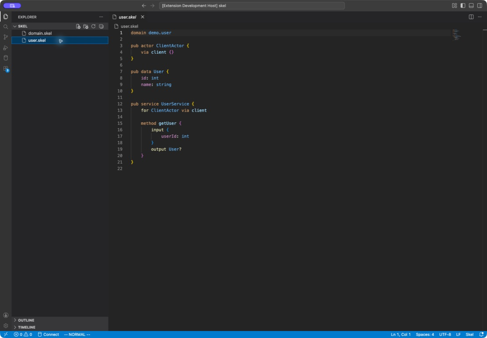

# Skel VS Code Support

[](https://github.com/yorun-ai/vscode-skel/actions/workflows/ci.yml)
[](LICENSE)
[](https://github.com/yorun-ai/vscode-skel/releases/latest)

The official VS Code extension for the [Skel](https://yorun.ai/skelc/syntax) contract language.



## Features

- TextMate syntax highlighting for Skel declarations, types, decorators, comments, and strings
- Live syntax diagnostics and document symbols from `skelc lsp`
- Go to Definition and Find All References across workspace Skel files
- A Skel-focused dark color theme
- Commands to restart the language server and open its output channel

## Installation

Install `skelc` first:

```sh
go install go.yorun.ai/skelc/cmd/skelc@latest
skelc lsp --help
```

Install the `Skel` extension from the VS Code Marketplace, then open a `.skel` file. The extension starts `skelc lsp` from `PATH`.

The extension requires a skelc build that provides the `lsp` command. Complete naming, type, and cross-domain semantic validation still belongs to `skelc check`.

## Configuration

| Setting | Default | Description |
| --- | --- | --- |
| `skelc.path` | `skelc` | Executable used to start the language server. Changing it restarts the server. |
| `skelc.trace.server` | `off` | Protocol tracing: `off`, `messages`, or `verbose`. |

Available commands:

- `Skel: Restart Language Server`
- `Skel: Show Language Server Output`

## Remote and Virtual Workspaces

The extension runs as a workspace extension. In Remote SSH, WSL, and Dev Container windows, install skelc in that remote environment or configure a remote value for `skelc.path`.

Untitled Skel documents receive language-server support. Virtual and untrusted workspaces are intentionally unsupported because the extension requires filesystem access and starts the configured executable.

## Troubleshooting

If the server does not start:

1. Run `skelc lsp --help` in the same environment as the VS Code extension host.
2. Set `skelc.path` to the executable's absolute path when it is not on `PATH`.
3. Run `Skel: Restart Language Server`.
4. Run `Skel: Show Language Server Output` and set `skelc.trace.server` to `messages` or `verbose` when protocol details are needed.

## Development

Install dependencies and run the normal checks:

```sh
npm ci
npm run check
```

Open this repository in VS Code and press F5 to launch the portable Extension Development Host configuration.

Protocol and Extension Host tests require a local skelc build with LSP support:

```sh
SKELC_PATH=/absolute/path/to/skelc npm run test:integration
SKELC_PATH=/absolute/path/to/skelc npm run test:extension
```

## License

Skel VS Code Support is open source under the Apache License 2.0. See [LICENSE](LICENSE).
